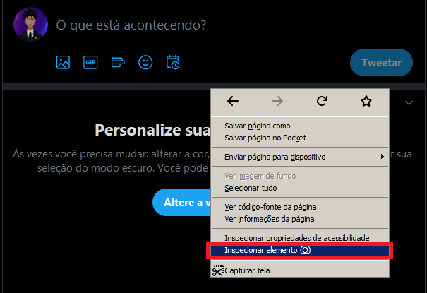
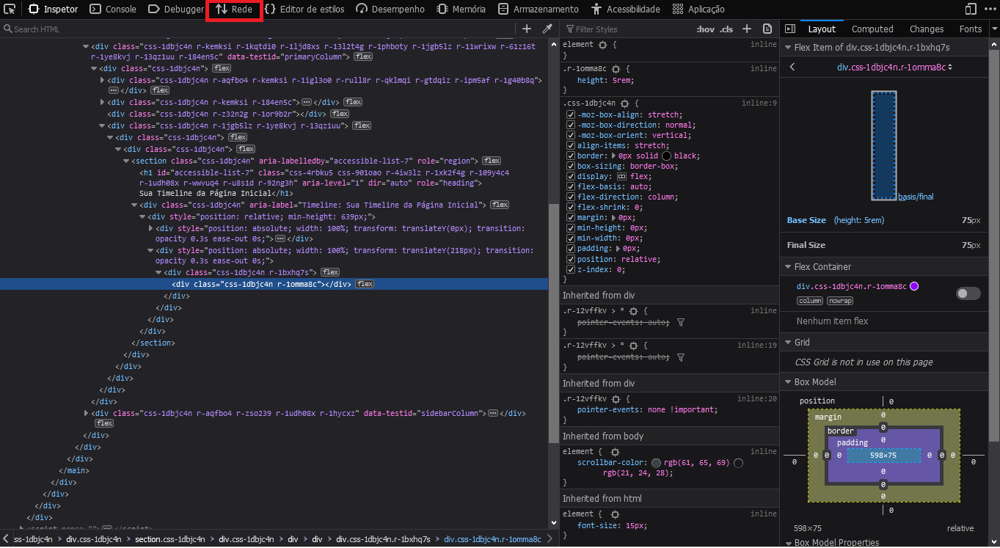
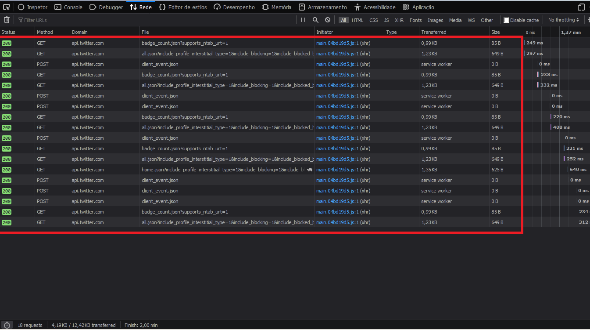
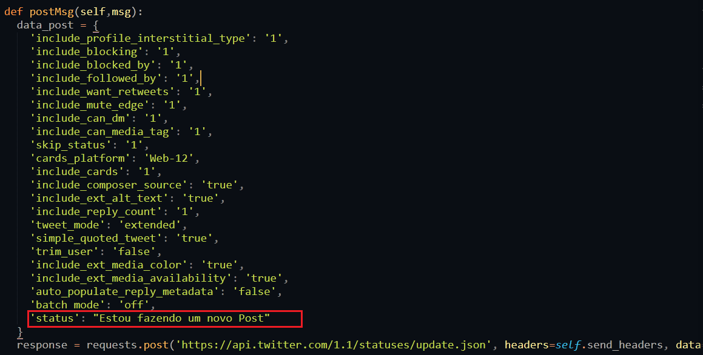
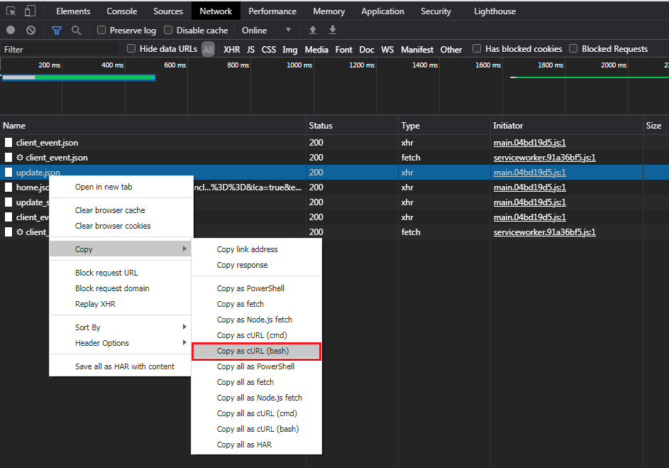
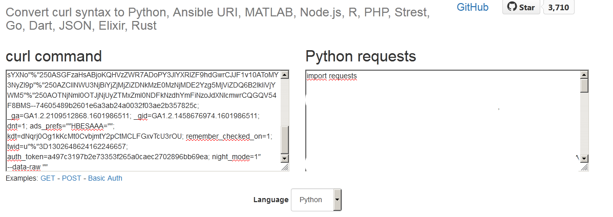
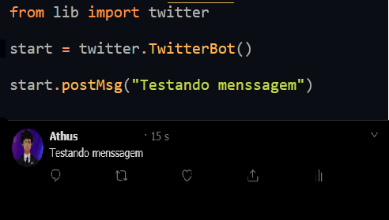

<h1 align="center">
  Twitter Bot Sem API
</h1>

<h1 align="center">
  
</h1>

## Como faremos isso?

- Primeiro iremos, entender um pouco sobre como podemos emular as ações humanas com um script,Se você clicar na pagina do twitter e inspecionar, e for até verá todas as request que seu navegador manda para o servidor do twitter, com base nisso você so precisa recriar essas chamada,Recomendo usar o Google Chromer para extrair os headers.

- Os headers consiste na parte que contém as informações suplementares colocados no começo de um bloco de dados que estão sendo armazenados ou transmitidos, usualmente por correio eletrónico ou em pacotes dos dados emitidos através da internet, são precedidos pela informação de cabeçalho tal como o remetente e os endereços do IP do receptor.- `wikipedia`

	
	
	

- Todos essa lista são as chamadas do seu navegador para o twitter, mandando algum "`codigo`" espesifico para realizar alguma ação, como por exemplo:

	

- A imagem acima mostra como seria a inserção de uma nova menssagem no seu twitter mandando um pedaço de "`codigo`" espesifico.

## Ao script:

- Já que sabemos como as request sao enviadas agora so precisamos recriar essas funcionalidades com uma linguagem da sua preferencia, toda vez que você faz alguma coisa no twitter ele envia um `update.json` onde esta alocado um comando que voce podera automatizar.

	
	

- Existe diversos site que você poderá converter o cURL pego do `update.json` para uma linguagem de programação da sua preferencia, no caso estou usando o site: `https://curl.trillworks.com/` que converte o cURL pego e converte em um script funcional em python

- Agora você so precisa fazer um script que mande os headers com seus parametros apontados para o endereço da api: `htps://api.twitter.com/1.1/statuses/update.json` fazendo assima emulação de um usuario normal

	

